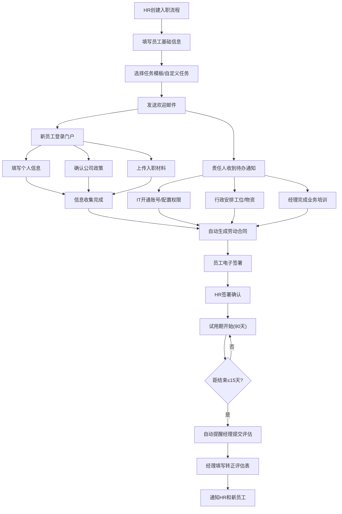
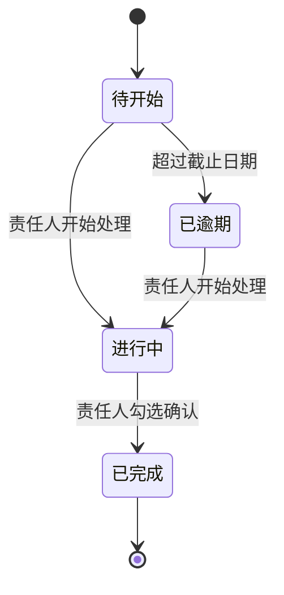

## 1. 产品概述

员工入职流程管理系统是一款面向企业的一站式入职全流程自动化管理平台。解决传统入职流程中任务分配混乱、文档签署低效、进度跟踪困难等痛点，实现从入职任务创建、信息收集、合同签署、试用期管理到转正评估的全链路数字化。

- **目标用户**：企业HR部门、IT运维、行政部、部门经理、新入职员工
- **核心价值**：缩短入职周期60%以上，提升新员工体验，降低企业合规风险

---

## 2. 核心功能

### 2.1 用户角色

| 角色 | 登录方式 | 核心权限 |
|------|---------|---------|
| HR管理员 | 账号密码 | 创建入职任务、全局进度监控、合同管理、系统配置 |
| IT责任人 | 账号密码 | 处理账号开通、权限配置、硬件发放等IT类任务 |
| 行政责任人 | 账号密码 | 处理工位安排、办公用品领取、门禁卡等行政任务 |
| 直属经理 | 账号密码 | 业务培训任务、试用期评估、转正评估提交 |
| 新员工 | 邮件链接登录 | 填写个人信息、确认政策、上传材料、电子签名、查看进度 |

### 2.2 功能模块

1. **HR仪表盘**：入职全局视图、员工列表、创建新入职流程、任务模板管理
2. **入职任务中心**：任务清单管理、任务分配、进度实时追踪、责任人视图
3. **新员工门户**：个人信息表单、政策确认、材料上传、入职进度查看
4. **合同管理**：劳动合同自动生成、电子签名流程、合同归档
5. **试用期管理**：试用期进度、转正提醒、转正评估表单、结果通知

### 2.3 页面详情

| 页面名称 | 模块名称 | 功能描述 |
|---------|---------|---------|
| 登录页 | 角色选择登录 | 支持多角色切换登录、新员工邮件链接快捷登录 |
| HR仪表盘 | 全局统计卡片 | 显示在途入职人数、完成率、待处理提醒、试用期预警 |
| HR仪表盘 | 员工入职进度列表 | 按员工展示进度条、关键节点时间、责任人状态、筛选搜索 |
| 新建入职流程 | 基本信息表单 | 填写新员工基本信息（姓名、部门、岗位、入职日期、薪资） |
| 新建入职流程 | 任务模板选择 | 选择预设任务模板或自定义任务清单、分配各责任人 |
| 新员工门户 | 欢迎横幅 | 显示欢迎语、入职日期、部门信息、关键联系人 |
| 新员工门户 | 个人信息表单 | 分步填写：基本信息、银行信息、教育经历、家庭成员、紧急联系人 |
| 新员工门户 | 政策文件确认 | 列表展示公司制度文件、支持在线预览、逐条勾选确认 |
| 新员工门户 | 材料上传区 | 拖拽上传身份证、学历证、照片等、支持预览与删除 |
| 新员工门户 | 合同签署 | 预览自动生成的劳动合同、电子签名输入框、签署确认 |
| 新员工门户 | 入职进度总览 | 时间线展示所有节点完成状态 |
| 任务责任人工作台 | 待办任务列表 | 按类型分类（IT/行政/经理）、可勾选完成、添加备注 |
| 转正评估 | 评估提醒卡 | 试用期结束前15天高亮提醒、显示剩余天数 |
| 转正评估 | 评估表单 | 工作能力、团队协作、出勤情况评分、综合评语、建议结果 |

---

## 3. 核心流程

### 3.1 入职主流程

HR创建入职流程 → 系统自动分配任务清单 → 发送欢迎邮件给新员工 → IT/行政/经理开始处理任务 → 新员工填写信息并上传材料 → 自动生成劳动合同 → 双方电子签署 → 试用期开始 → 系统自动提醒转正评估 → 经理提交评估 → 结果通知HR与新员工

### 3.2 任务状态流转

---

## 4. 用户界面设计

### 4.1 设计风格

- **主色调**：深海蓝 `#0F4C81`（专业、信任） + 青绿色 `#2DD4A8`（活力、成长）
- **辅助色**：琥珀橙 `#F59E0B`（提醒） + 珊瑚红 `#EF4444`（警告）
- **按钮风格**：圆角12px，主按钮渐变填充，悬停上浮2px微阴影
- **字体方案**：标题使用「思源宋体」衬线体增强专业感，正文使用「HarmonyOS Sans」无衬线体
- **布局风格**：卡片式布局 + 微妙阴影分层 + 左侧导航栏
- **装饰元素**：渐变背景光斑、细线分割、柔和光晕

### 4.2 页面设计概览

| 页面名称 | 模块名称 | UI元素 |
|---------|---------|-------|
| HR仪表盘 | 统计卡片 | 渐变背景+毛玻璃效果、数字动效、趋势小箭头 |
| HR仪表盘 | 进度列表 | 数据表格+渐变色进度条、状态徽章、行悬停高亮 |
| 新员工门户 | 欢迎横幅 | 蓝绿渐变背景、装饰性几何图形、欢迎语动效 |
| 新员工门户 | 步骤表单 | 步骤指示条、卡片分组、字段焦点动画 |
| 新员工门户 | 进度时间线 | 左侧竖线时间轴、完成节点用绿色打勾图标 |
| 合同签署 | 合同预览 | 仿纸张质感白色卡片、签名画布、印章效果 |
| 任务工作台 | 待办列表 | 可折叠任务卡片、勾选带动画、备注输入区 |
| 转正评估 | 提醒卡 | 琥珀色渐变边框、倒计时数字放大显示 |

### 4.3 响应式设计

- **桌面优先**：最小支持1440px宽度，主内容区固定1280px
- **平板适配**：导航栏折叠为汉堡菜单，卡片网格从4列变2列
- **移动适配**：单列布局，表格转卡片列表，表单字段全宽

### 4.4 动效设计

- 页面加载：元素从下往上渐入，stagger延迟100ms
- 进度更新：进度条数字滚动+进度填充平滑过渡
- 勾选完成：✅图标弹性缩放动画+绿色光晕扩散
- 卡片悬停：上浮4px+阴影加深，0.3s ease-out
- 表单校验：错误信息从下方滑入，输入框红色脉动边框
