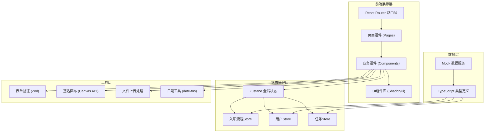
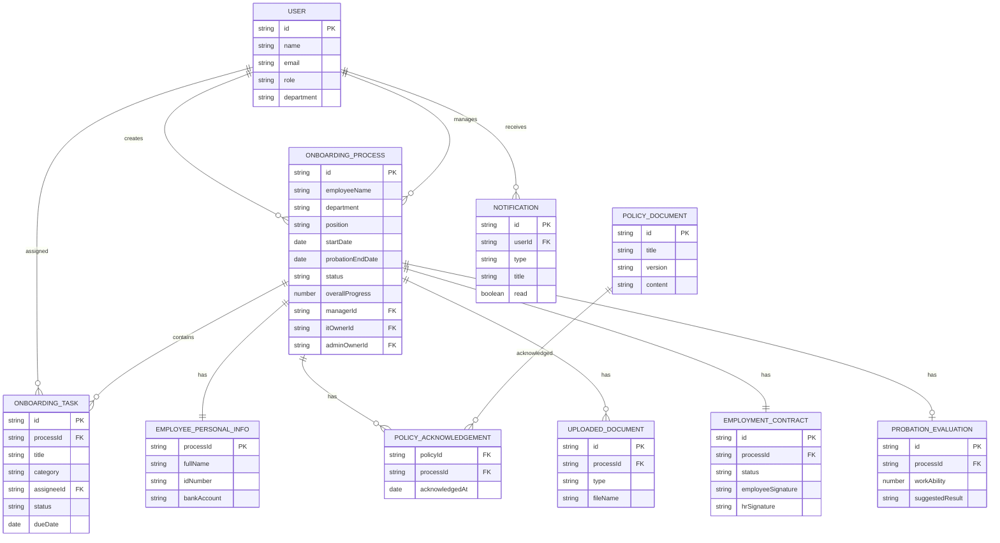

## 1. 架构设计

本系统采用纯前端单页应用架构，使用React + TypeScript构建，所有数据通过本地状态管理和Mock数据模拟后端交互，方便后续接入真实API。



---

## 2. 技术选型

| 类别 | 技术 | 版本 | 说明 |
|-----|-----|------|------|
| 前端框架 | React | 18.x | 使用函数式组件 + Hooks |
| 构建工具 | Vite | 5.x | 快速冷启动与热更新 |
| 语言 | TypeScript | 5.x | 类型安全保证 |
| 样式方案 | Tailwind CSS | 3.x | 原子化CSS + 自定义主题 |
| UI组件 | Shadcn/ui | - | 基于Radix UI的高质量组件库 |
| 状态管理 | Zustand | 4.x | 轻量级状态管理 |
| 路由 | React Router DOM | 6.x | 客户端路由 |
| 表单处理 | React Hook Form | 7.x | 高性能表单库 |
| 验证 | Zod | 3.x | Schema验证，与TS类型结合 |
| 日期处理 | date-fns | 3.x | 模块化日期工具 |
| 图标 | Lucide React | - | 一致性图标库 |
| 动画 | Framer Motion | 11.x | 声明式动画库 |

---

## 3. 路由定义

| 路由路径 | 页面 | 说明 | 访问角色 |
|---------|-----|------|---------|
| `/login` | LoginPage | 登录页，支持角色选择 | 全部 |
| `/` | DashboardRedirect | 根路径重定向 | - |
| `/hr/dashboard` | HrDashboardPage | HR仪表盘，全局入职视图 | HR |
| `/hr/new-onboarding` | NewOnboardingPage | 创建新入职流程 | HR |
| `/hr/employee/:id` | EmployeeDetailPage | 员工入职详情页 | HR |
| `/employee/:id/portal` | EmployeePortalPage | 新员工门户首页 | 新员工 |
| `/employee/:id/personal-info` | PersonalInfoPage | 个人信息填写 | 新员工 |
| `/employee/:id/policies` | PoliciesPage | 公司政策确认 | 新员工 |
| `/employee/:id/documents` | DocumentsPage | 材料上传 | 新员工 |
| `/employee/:id/contract` | ContractSignPage | 劳动合同签署 | 新员工 |
| `/tasks` | TasksWorkspacePage | 任务责任人工作台 | IT/行政/经理 |
| `/manager/evaluation/:id` | EvaluationPage | 转正评估表单 | 直属经理 |
| `/manager/evaluations` | EvaluationListPage | 评估列表 | 直属经理 |

---

## 4. 核心类型定义

```typescript
// 用户类型
export type UserRole = 'HR' | 'IT' | 'ADMIN' | 'MANAGER' | 'EMPLOYEE';

export interface User {
  id: string;
  name: string;
  email: string;
  role: UserRole;
  avatar?: string;
  phone?: string;
  department?: string;
}

// 入职流程
export type OnboardingStatus = 
  | 'CREATED' 
  | 'INFO_COLLECTING' 
  | 'TASKS_IN_PROGRESS' 
  | 'CONTRACT_PENDING' 
  | 'PROBATION' 
  | 'EVALUATION_PENDING' 
  | 'COMPLETED';

export interface OnboardingProcess {
  id: string;
  employeeId: string;
  employeeName: string;
  employeeEmail: string;
  department: string;
  position: string;
  startDate: string;
  salary: number;
  contractType: string;
  probationEndDate: string;
  status: OnboardingStatus;
  overallProgress: number;
  createdAt: string;
  createdBy: string;
  managerId: string;
  itOwnerId: string;
  adminOwnerId: string;
}

// 任务类型
export type TaskCategory = 'IT' | 'ADMIN' | 'MANAGER' | 'EMPLOYEE';
export type TaskStatus = 'PENDING' | 'IN_PROGRESS' | 'COMPLETED' | 'OVERDUE';

export interface OnboardingTask {
  id: string;
  processId: string;
  title: string;
  description: string;
  category: TaskCategory;
  assigneeId: string;
  assigneeName: string;
  status: TaskStatus;
  dueDate: string;
  completedAt?: string;
  notes?: string;
}

// 新员工个人信息
export interface EmployeePersonalInfo {
  processId: string;
  fullName: string;
  gender: 'MALE' | 'FEMALE';
  idNumber: string;
  birthDate: string;
  phone: string;
  address: string;
  bankAccount: string;
  bankName: string;
  education: EducationRecord[];
  emergencyContact: EmergencyContact;
}

export interface EducationRecord {
  school: string;
  degree: string;
  major: string;
  startDate: string;
  endDate: string;
}

export interface EmergencyContact {
  name: string;
  relationship: string;
  phone: string;
}

// 政策确认
export interface PolicyDocument {
  id: string;
  title: string;
  version: string;
  summary: string;
  content: string;
}

export interface PolicyAcknowledgement {
  policyId: string;
  processId: string;
  acknowledgedAt: string;
  signature: string;
}

// 入职材料
export type DocumentType = 'ID_CARD_FRONT' | 'ID_CARD_BACK' | 'DIPLOMA' | 'PHOTO' | 'OTHER';

export interface UploadedDocument {
  id: string;
  processId: string;
  type: DocumentType;
  fileName: string;
  uploadDate: string;
  fileSize: number;
}

// 合同
export interface EmploymentContract {
  id: string;
  processId: string;
  content: string;
  generatedAt: string;
  employeeSignature?: string;
  employeeSignedAt?: string;
  hrSignature?: string;
  hrSignedAt?: string;
  status: 'GENERATED' | 'EMPLOYEE_SIGNED' | 'FULLY_SIGNED';
}

// 转正评估
export type EvaluationResult = 'PASS' | 'EXTEND' | 'FAIL';

export interface ProbationEvaluation {
  id: string;
  processId: string;
  managerId: string;
  workAbility: number;
  teamCollaboration: number;
  attendance: number;
  learningAgility: number;
  overallComment: string;
  suggestedResult: EvaluationResult;
  submittedAt: string;
}

// 通知
export type NotificationType = 
  | 'TASK_ASSIGNED' 
  | 'CONTRACT_READY' 
  | 'EVALUATION_REMINDER' 
  | 'EVALUATION_SUBMITTED' 
  | 'WELCOME';

export interface Notification {
  id: string;
  userId: string;
  type: NotificationType;
  title: string;
  message: string;
  read: boolean;
  createdAt: string;
}
```

---

## 5. 数据模型ER图



---

## 6. 组件目录结构

```
src/
├── assets/                 # 静态资源
├── components/
│   ├── ui/                # Shadcn/ui 基础组件
│   ├── layout/            # 布局组件
│   │   ├── Sidebar.tsx
│   │   ├── Header.tsx
│   │   └── RoleBasedLayout.tsx
│   ├── hr/                # HR相关组件
│   │   ├── StatsCard.tsx
│   │   ├── ProgressTable.tsx
│   │   └── OnboardingForm.tsx
│   ├── employee/          # 新员工相关组件
│   │   ├── WelcomeBanner.tsx
│   │   ├── PersonalInfoForm.tsx
│   │   ├── PolicyList.tsx
│   │   ├── DocumentUploader.tsx
│   │   ├── SignaturePad.tsx
│   │   └── ProgressTimeline.tsx
│   ├── tasks/             # 任务相关组件
│   │   ├── TaskCategoryTabs.tsx
│   │   └── TaskCard.tsx
│   ├── manager/           # 经理相关组件
│   │   ├── EvaluationReminderCard.tsx
│   │   └── EvaluationForm.tsx
│   └── shared/            # 通用组件
│       ├── ProgressBar.tsx
│       ├── StatusBadge.tsx
│       └── Avatar.tsx
├── pages/                 # 页面组件
├── store/                 # Zustand stores
│   ├── useUserStore.ts
│   ├── useOnboardingStore.ts
│   ├── useTaskStore.ts
│   └── useNotificationStore.ts
├── types/                 # TypeScript类型
├── data/                  # Mock数据
│   ├── mockUsers.ts
│   ├── mockPolicies.ts
│   └── mockProcesses.ts
├── lib/                   # 工具函数
│   ├── dateUtils.ts
│   ├── contractGenerator.ts
│   ├── progressCalculator.ts
│   └── validationSchemas.ts
├── hooks/                 # 自定义Hooks
├── router/                # 路由配置
├── App.tsx
├── main.tsx
└── index.css
```

---

## 7. 前端技术约束

1. **TypeScript严格模式**：启用 `strict: true`，禁止使用 `any`，所有API响应和状态必须有明确类型
2. **组件设计原则**：优先函数式组件，最大深度不超过3层，组件行数控制在200行以内
3. **样式规范**：统一使用Tailwind CSS，禁止写内联样式（动画样式除外），主题变量统一在 `tailwind.config.ts` 中定义
4. **状态管理**：跨组件共享状态用Zustand，组件内部状态用useState/useReducer，禁止props drilling超过3层
5. **表单规范**：所有表单使用React Hook Form + Zod验证，错误提示统一用表单控件自带error属性
6. **性能优化**：列表渲染必须加key，复杂计算用useMemo，事件处理函数用useCallback，大数据量分页/虚拟列表
7. **可访问性**：所有交互元素有aria-label，表单有label关联，颜色对比度达标，支持键盘导航
8. **错误边界**：页面级别包裹ErrorBoundary，异步操作必须有try/catch，错误状态有UI反馈
